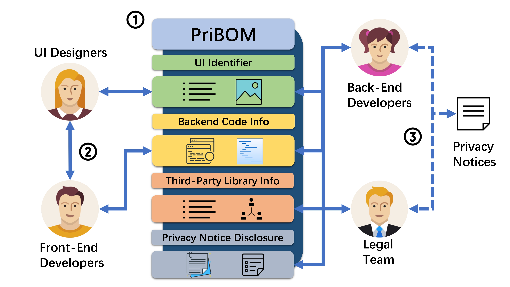
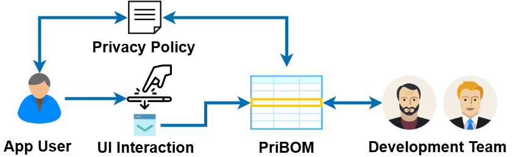

# PriBOM

This repository is for the project Privacy Bills of Material. 

🚀 To the best of our knowledge, we are the first to systematically summarise the privacy notice generation tools.

🚀 We introduce the concept of **PriBOM** (Privacy Bills of Material) and propose a proof-of-concept implementation for mobile app development.

🚀 We conduct a usability evaluation to quantitatively and qualitatively assess the design of **PriBOM**.  

## Overview

## Folder Structure

- `user_study/`: Survey materials, including the complete survey questionnaire.

We are adding more content. Stay tuned!