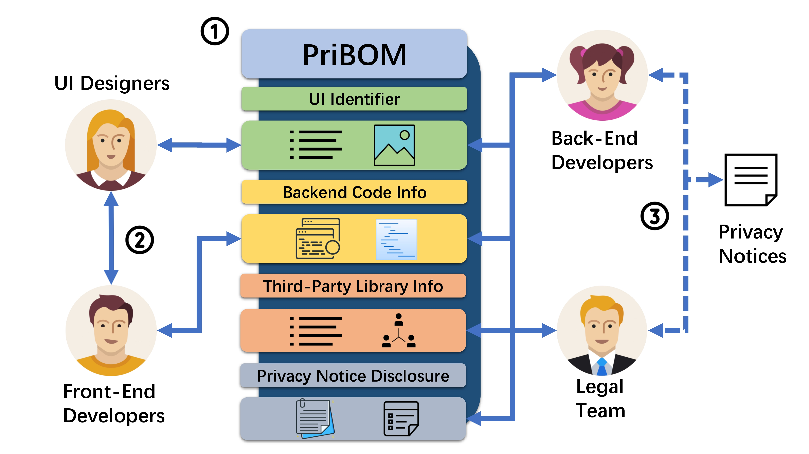

# Privacy Bills of Material

This repository is for the project **PriBOM** (Privacy Bills of Material). 

🚀 To the best of our knowledge, we are the first to systematically summarise the privacy notice generation tools.

🚀 We introduce the concept of **PriBOM** and propose a pre-fill for mobile app development.

🚀 We conduct a human evaluation to comprehsnsively assess the usefulness of **PriBOM**.  

## Overview

The use cases of PriBOM.

<!-- 

An overview of PriBOM in the practical usage scenario.

 -->

## Dependency

Python 3.8.18

GATOR 3.8

Androguard 4.0.1

Setuptools 68.2.2

Threadpool 1.3.2

Wheel 0.41.2

## Folder Structure

- `Survey/`: Survey materials, including the complete survey questionnaire.
- `APK/`: Input APK files.
- `Callgraph/`: Extracted call graphs.
- `InfoSet/`: Extracted widget detail.
- `Mapping/`: Extracted Android permission mappings.
- `XML2CSV/`: CSV files containing widget information.
- `XMLOutput/`: XML files on widget.
- `Common.py`: Common file path definition.
- `GATORRun.py`: Extract the widget based on GATOR. 
- `JADXdecompile.py`: Decompile the APK file.
- `XMLParser.py`: Parse the XML files in XMLOutput.
- `WidgetInfo.py`: Extract widget detail.
- `Mapping.py`: Construct call graphs and map Android permissions.